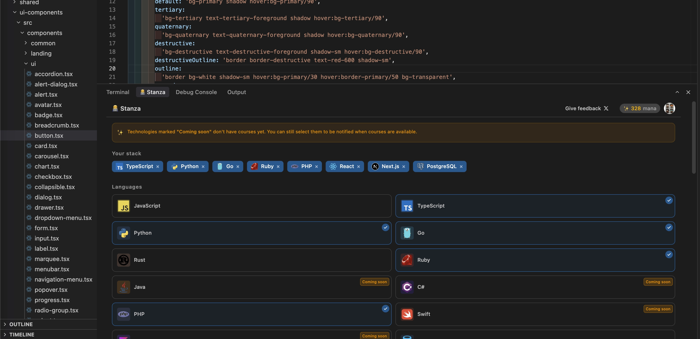
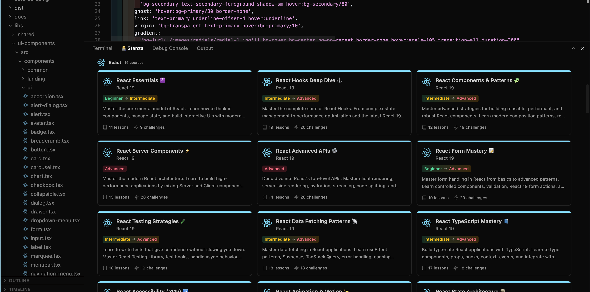
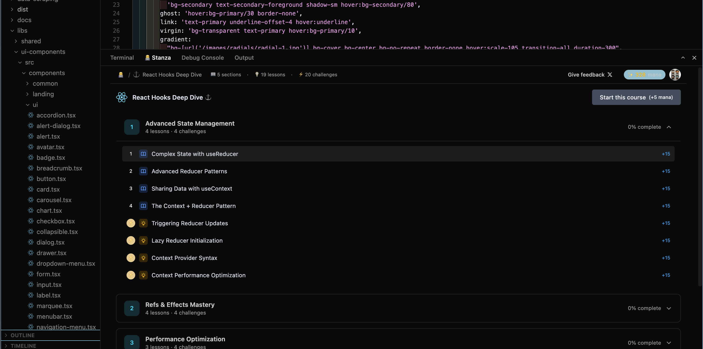
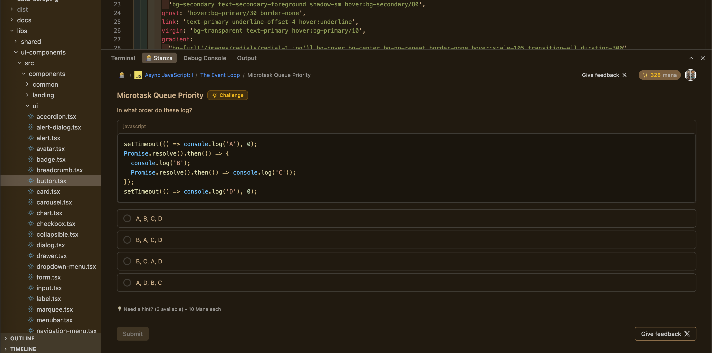
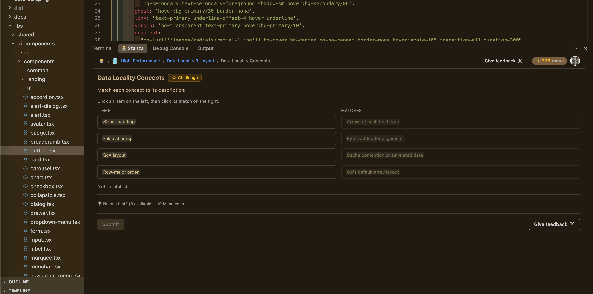

### Access to this extension for free here: [VsCode marketplace](https://marketplace.visualstudio.com/items?itemName=stanzadev.stanza)

# Stanza: Micro-learning platform right in your IDE

Stanza brings bite-sized coding challenges, interactive lessons, and skill assessments directly into your IDE,

<video src="https://raw.githubusercontent.com/stanza-dev/stanza_extension_assets/refs/heads/main/videos/stanza-demo-compressed.mp4"></video>

Don't be passive while waiting for AI, CI, Tests...
- Master code while you write it
- Master code while you wait for AI
- Master code while you run your tests

You can use Stanza on VsCode, Cursor, Antigravity and Windsurf,

Stanza is currently in beta supporting the majority of the most popular languages and frameworks but courses are constanlty added to satisfies everyone.

## ✨ Features

### Integrated Learning Panel
Access a library of challenges and track your progress without leaving your IDE.

### Interactive Challenges
Test the concepts you are learning in the lessons and Stanza verifies your solution instantly.

## 🏁 Getting Started

1.  Install the **Stanza** extension.
2. Open your terminal and click on the Stanza tab.
3.  Sign in with Github and start learning.

## 📣 Feedback & Support

Stanza is still in beta version so we value your feedback, please contact me on [Twitter](https://x.com/OliGila) or drop your question / feedback on our subredit [Reddit](https://www.reddit.com/r/stanza_dev/) 🫶
